# Question 1

# Table of Contents
1. [Question 1](#question-1)
   1. [Overall Design and Components](#overall-design-and-components)
      1. [zkRollup Components](#zkrollup-components)
      2. [External Components/Services](#external-componentsservices)
      3. [Monitoring Services](#monitoring-services)
   2. [Network Design](#network-design)
      1. [Public Subnets Group](#public-subnets-group)
      2. [Private App Subnets](#private-app-subnets-accessible-from-all-the-other-private-subnets)
      3. [Private Subnets Core Group](#private-subnets-core-group-eks-core-node-group)
      4. [Private Subnets Data Group](#private-subnets-data-group)
      5. [Private Subnets Compute Group](#private-subnets-compute-group-eks-prover-node-group)
   3. [Deployments and Automation](#deployments-and-automation)
      1. [Infrastructure Set up](#infrastructure-set-up)
      2. [Scaling and Orchestration](#scaling-and-orchestration)
      3. [Kubernetes Clusters](#kubernetes-clusters)
      4. [Build and Deployment Automation](#build-and-deployment-automation)

## Overall Design and Components

### zkRollup Components:
- Rollup node
- Prover
- Sequencer
- State manager 
- State database
- DA connector for Vallidium

### External Components/Services
- L1 Node
- DA Layer for Vallidium
- Parameter Store (secrets and configurations for cloud)

### Monitoring Services
- Prometheus for metrics collection
- Cloudwatch/ Grafana for visualization

## Network Design:
- Single VPC
- Multiple Subnets (some private, some public)
- 2 AZ per group

### Public Subnets Group:
- Application Load Balancer
- NAT Gateway

### Private App Subnets (Accessible from all the other private subnets):
- API Gateway Service (ECS/EKS)
- Monitoring Services
- Config Manager

### Private Subnets Core Group (EKS Core Node Group):
- Rollup Node
- Sequencer
- State Manager
- DA Connector

### Private Subnets Data Group:
- Databases (RDS/Postgresql)
- Caching Layer (Elasticache/Redis)

### Private Subnets Compute Group (EKS Prover Node Group):
- Proof Coordinator (Compute optimized)
- Prover Workers (GPU)

## Deployments and Automation

### Infrastructure Set up:
Infrastructure as Code to:
- Deploy network resources (VPC, subnets, internet gateways, security groups
- Deploy EKS cluster and node groups
- Configure node group labels and taints
- Set up network policies
- Deploy API Gateway 
- Deploy Monitoring Service
- Deploy Config Manager (on compute unit, or cloud solution like Parameter Store)
- Deploy secrets manager (for secure internal DB access)
- Deploy Caching 
- Deploy Database
- Deploy VPC Endpoints for AWS services

### Scaling and Orchestration:
Kubernetes/EKS Clusters to:
- Pod/container deployments
- Managing the use cases in separate nodegroups and namespaces
- Scaling compute resources horizontally as needed
- Load balancing
- Resource quotas and limits 
- Pod disruption budgets for critical services

### Kubernetes Clusters:
- Rollup Node
- Sequencer
- Prover coordinator
- Prover worker
- State manager
- DA Connector
- API Gateway
- Config Manager
- Monitoring

### Build and Deployment Automation:
Github Actions 
- Automate docker building and pushing to the image registry
- Resource deployments (manage DA connector, no DA connector)
- Kubernetes manifest deployments
- Tests
- Security scanning for containers
- Configuration validation

Docker 
- Containerization of rollup node, prover, sequencer, state manager, api gateway, monitoring stack, config manager, secrets manager
